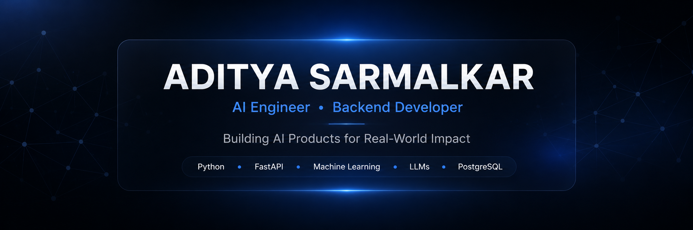

<!-- ========================================================= -->
<!--                     HERO SECTION                           -->
<!-- ========================================================= -->

<p align="center">
  
</p>

<br>

---

<div align="center">

<a href="https://www.linkedin.com/in/aditya-sarmalkar-7b302a251">

</a>

<a href="mailto:YOUR_EMAIL">

</a>

<a href="https://github.com/Wrenchded">

</a>

<a href="YOUR_PORTFOLIO_LINK">

</a>

</div>

---

# 👋 About Me

I'm a Software Engineer from **India** passionate about building
real-world AI products and scalable backend systems.

My interests lie at the intersection of

- Artificial Intelligence
- Backend Engineering
- Machine Learning
- Data Science
- System Design

I enjoy building software that solves practical problems rather than
just experimenting with technology.

Currently, I'm focused on designing AI-powered applications,
production-grade APIs, and intelligent automation systems.

---

# 🚀 Current Focus

```text
✓ AI Engineering

✓ LLM Applications

✓ FastAPI Backend Development

✓ Machine Learning Systems

✓ Recommendation Engines

✓ Data Science

✓ RAG Applications

✓ Distributed Systems
```

---

# 💡 Engineering Philosophy

> **"Great software isn't just built to work—it's built to solve meaningful problems, scale gracefully, and create lasting impact."**

---

# 📍 Quick Facts

🧠 AI Engineer & Backend Developer

🎓 B.E. in Information Technology

🌏 Based in India

🚀 Passionate about AI Products & SaaS

💬 Always exploring better software architecture

☕ Coffee-powered problem solver

<!-- ========================================================= -->
<!--                    SELECTED WORK                           -->
<!-- ========================================================= -->

# Selected Work

A collection of AI products, backend systems, and software solutions I've designed and built to solve real-world problems.

---

## 🚗 AutoVerse

### AI-Powered Automotive Marketplace

Production-ready marketplace combining Machine Learning, recommendation systems, computer vision, and scalable backend APIs.

**Highlights**

- AI Price Prediction
- Recommendation Engine
- Vehicle Damage Detection
- JWT Authentication

**Built With**


**Repository**

[📂 View Repository](YOUR_AUTOVERSE_REPO_LINK)

---

## 🏢 Commercial Property Management SaaS

### Enterprise Client Project

Designed and developed a scalable SaaS platform for commercial property owners to manage rental operations, tenants, agreements, and administrative workflows.

**Highlights**

- Tenant Management
- Visitor Management
- Digital Rent Collection
- Invoice Generation
- Maintenance Tickets
- Admin Dashboard

**Built With**


**Repository**

🔒 Private Repository (Client Confidential)

---

## 📄 PDF Mind

### Offline AI Document Assistant

Private AI-powered document intelligence platform that allows users to chat with PDFs completely offline.

**Highlights**

- Local LLM
- Semantic Search
- Chat with PDFs
- Privacy First

**Built With**


**Repository**

[📂 View Repository](YOUR_PDFMIND_LINK)

---

## 📊 ResumeRank AI

### AI Resume Intelligence Platform

AI-powered resume analyzer providing ATS optimization and actionable resume feedback.

**Highlights**

- ATS Analysis
- AI Feedback
- Resume Scoring
- Keyword Optimization

**Impact**

🚀 Used by **100+ users**

**Built With**


**Repository**

[📂 View Repository](YOUR_RESUMERANK_LINK)

---

## 🤖 AdiX

### Personal AI Assistant

Self-hosted AI assistant focused on intelligent conversations, privacy, and extensibility.

**Highlights**

- Gemini API Integration
- Modular Architecture
- Secure Backend
- Fast Responses

**Built With**


**Repository**

[📂 View Repository](YOUR_ADIX_LINK)

<br>

<!-- ========================================================= -->
<!--                  ENGINEERING STACK                         -->
<!-- ========================================================= -->

<br>

# Engineering Stack

The technologies and tools I use to design, build, and deploy intelligent software systems.

---

## Languages

<p>


</p>

---

## Backend Development

<p>


</p>

---

## Artificial Intelligence & Machine Learning

<p>


</p>

---

## Databases

<p>


</p>

---

## Frontend

<p>


</p>

---

## Developer Tools

<p>


</p>

---

# Engineering Interests

<table>

<tr>

<td width="33%" align="center">

### AI

Machine Learning

Deep Learning

LLMs

RAG

Agents

</td>

<td width="33%" align="center">

### Backend

FastAPI

REST APIs

Authentication

Microservices

System Design

</td>

<td width="33%" align="center">

### Data

PostgreSQL

Analytics

ETL

Data Processing

Visualization

</td>

</tr>

</table>

---

# Currently Exploring

```text
✓ MLOps

✓ Distributed Systems

✓ AI Agents

✓ Model Deployment

✓ Cloud Infrastructure

✓ High Performance APIs

✓ Scalable Software Architecture

✓ Vector Databases
```


<!-- ========================================================= -->
<!--                  LET'S CONNECT                             -->
<!-- ========================================================= -->

<br>

# Let's Connect

I'm always interested in discussing **AI, Machine Learning, Backend Engineering, Open Source, and building impactful software.**

<p align="center">

<a href="https://www.linkedin.com/in/aditya-sarmalkar-7b302a251">

</a>

&nbsp;

<a href="mailto:YOUR_EMAIL">

</a>

&nbsp;

<a href="https://github.com/Wrenchded">

</a>

&nbsp;

<a href="YOUR_PORTFOLIO">

</a>

</p>

---

<p align="center">

### Thanks for stopping by.

I enjoy building software that solves meaningful problems through thoughtful engineering, intelligent systems, and scalable architecture.

</p>

<br>

<p align="center">


</p>
